# 1.Environment Installation
## 1.1 Create your Cloud Host
Setting the Cloud Host Name
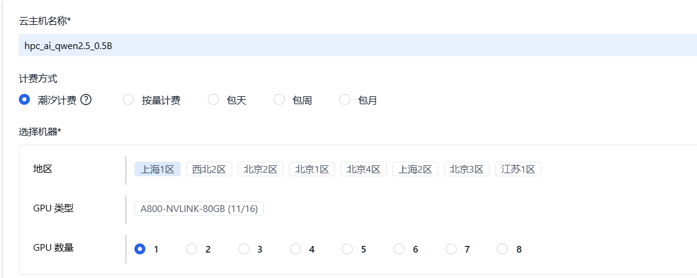
Select Mirror Image
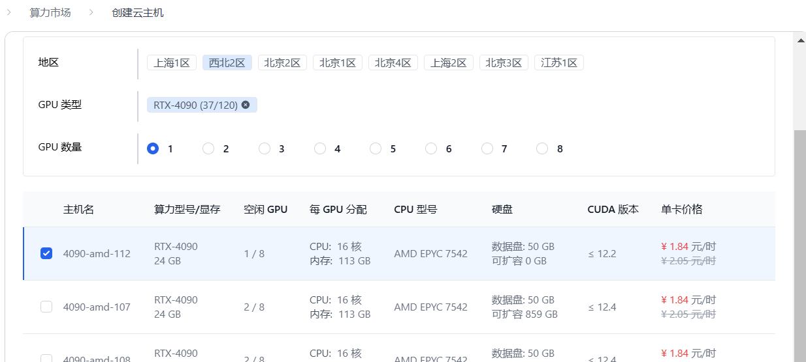
# 2.Model & Data Download
## 2.1 Download your model 
Here, we use a Qwen 2.5-0.5B as an example
First, write a script "download_qwen.py" to download your model.
```shell
import os

os.environ['HF_ENDPOINT'] = 'https://hf-mirror.com'
os.system('huggingface-cli download --resume-download Qwen/Qwen2.5-0.5B-Instruct --local-dir /root/dataDisk/model/qwen/ --local-dir-use-symlinks False')
```
Then, execute "download_qwen.py" use following cmd
```shell
python3 download_qwen.py
```
The model will be downloaded to the specified directory
```shell
python3 download_qwen.py
```
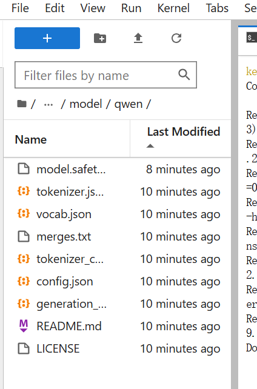

## 2.2 Upload your dataset (to Cloud)
Click on the Upload Data button (Red square in the following picture)
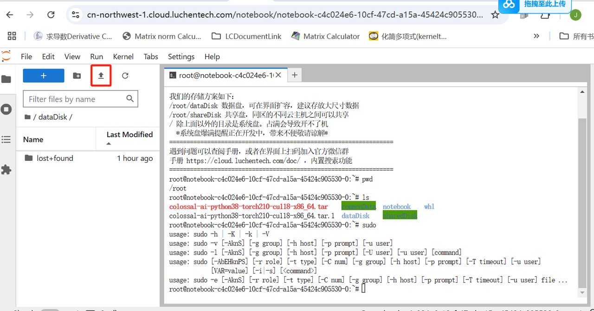
Specify the data you want to upload
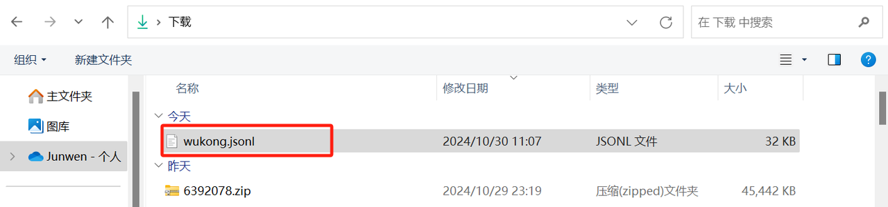
Hint:
The data format is json or jsonl.
We use 100 nums of data, and each piece of data is structured as follows
```shell
{
message:
[
{"from": "user", "content": "question"}, 
{"from": "assistance", "content": "answer to this question"}, 
]
}
```

## 2.3 Upload your dataset (to Open Access Dictionary)
First, upload data to the cloud (see 2.2 for details)
Then copy the data from the cloud /root/commonData
Execute the following command:
```shell
cp dataDisk/wukong.jsonl commonData/Wukong
```

# 3.How to run your task
# 3.1 Finetune
Write finetune script
```shell
import json
import torch
import colossalai
from tqdm import tqdm
from colossalai.booster import Booster
from colossalai.cluster import DistCoordinator
from colossalai.nn.optimizer.hybrid_adam import HybridAdam
from transformers import AutoModelForCausalLM, AutoTokenizer
from colossalai.booster.plugin import HybridParallelPlugin

# model_name = "Qwen/Qwen2.5-0.5B-Instruct"
model_name = "/root/dataDisk/model/qwen"
data_path = "/root/commonData/Wukong/wukong.jsonl"

# init dist env
colossalai.launch_from_torch()
coordinator = DistCoordinator()

# init plugin & booster
plugin = HybridParallelPlugin(
    tp_size=1,
    pp_size=1,
    zero_stage=1,
    enable_fused_normalization=torch.cuda.is_available(),
    microbatch_size=1,
    precision="bf16",
)

booster = Booster(plugin=plugin)

# init model, tokenizer, optimizer
model = AutoModelForCausalLM.from_pretrained(
    model_name,
    torch_dtype="auto",
    device_map="cuda"
)
tokenizer = AutoTokenizer.from_pretrained(model_name)
optimizer = HybridAdam(model.parameters())

# load data & init data
messages = []
with open(data_path) as f:
    for line in f:
        content = json.loads(line)['messages'][0]['content']
        messages.append(content)

encoded_batch = tokenizer(messages, padding=True, truncation=True, return_tensors="pt")
dataloader = plugin.prepare_dataloader(encoded_batch, batch_size=4, shuffle=True, drop_last=True, seed=42)
model, optimizer, _, dataloader, _ = booster.boost(model, optimizer, dataloader=dataloader)

# Train 
for epoch in range(10):
    # for step, batch in enumerate(tqdm(iter([encoded_batch]), desc="Step")):
    for step, batch in enumerate(tqdm(dataloader, desc="Step")):
        for k, v in batch.items():
            batch[k] = v.to('cuda:0')
        outputs = model(**batch)
        loss = outputs[0]
        del outputs  # free memory
        print(f"Epoch {epoch} Step {step} loss: {loss}")
        # loss.mean().backward()
        booster.backward(loss, optimizer)
        optimizer.step()
        optimizer.zero_grad()

# save model use booster
model_ckpt_path = "/root/dataDisk/model/qwen_shard_save"
optimizer_ckpt_path = "/root/dataDisk/model/qwen_shard_optim_save"
booster.save_model(model, model_ckpt_path, shard=True)
booster.save_optimizer(optimizer, optimizer_ckpt_path, shard=True)
```

Execute this finetune script by following command:
```shell
torchrun --nproc_per_node=1 --nnodes=1 --node_rank=0 --master_addr=127.0.0.1 --master_port=29500 hpcai_qwen/finetune.py 
```

# 3.2 Inference
Write inference scripts
```shell
import json
import torch
from transformers import AutoModelForCausalLM, AutoTokenizer

# model_name = "Qwen/Qwen2.5-0.5B-Instruct"
model_name = "/root/dataDisk/model/qwen"
model_ckpt_path = "/root/dataDisk/model/qwen_shard_save"
data_path = "/root/commonData/Wukong/wukong.jsonl"
model = AutoModelForCausalLM.from_pretrained(
    model_ckpt_path,
    torch_dtype="auto",
    device_map="auto"
)

tokenizer = AutoTokenizer.from_pretrained(model_name)

messages = []
with open(data_path) as f:
    for line in f:
        content = json.loads(line)['messages'][0]
        new_content = {"role": content['from'], "content": content['content']}
        messages.append(new_content)
print(f"messages {messages}")

for message in messages[:5]:
    text = tokenizer.apply_chat_template(
        [message],
        tokenize=False,
        add_generation_prompt=True
    )
    model_inputs = tokenizer([text], return_tensors="pt").to(model.device)
    
    generated_ids = model.generate(**model_inputs, max_new_tokens=512)
    
    generated_ids = [
        output_ids[len(input_ids):] for input_ids, output_ids in zip(model_inputs.input_ids, generated_ids)
    ]
    
    response = tokenizer.batch_decode(generated_ids, skip_special_tokens=True)[0]
    print(f"response {response}")
```
Execute this inference script by following command:
```shell
python hpcai_qwen/inference.py 
```

Then you will get some output by inference scripts
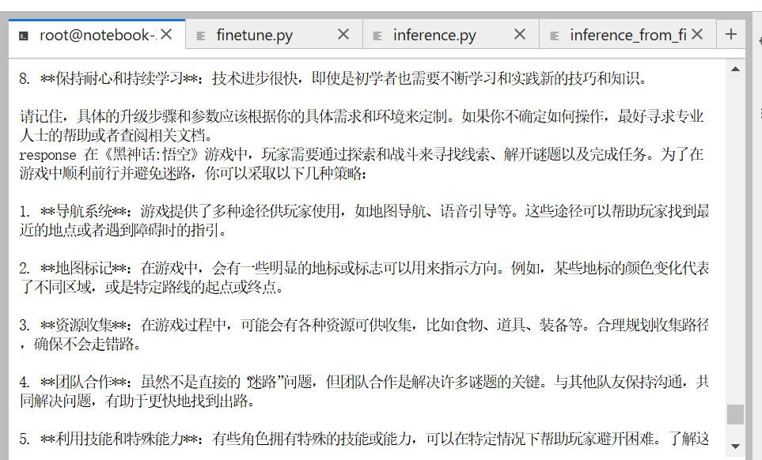


# 4.Save your submission
# 4.1 Save your repo
Create a repo as a contestant
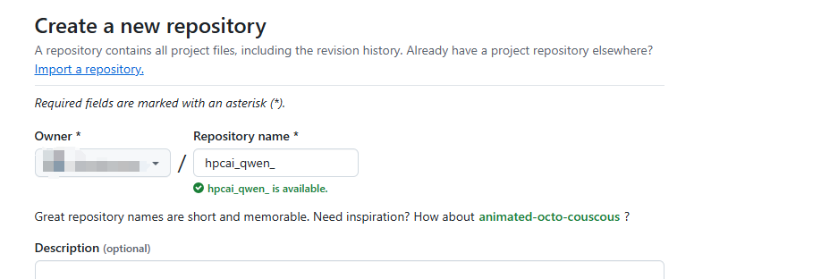

Cloning your repo to Cloud
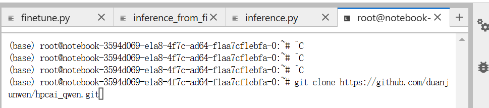

Write code in your repo
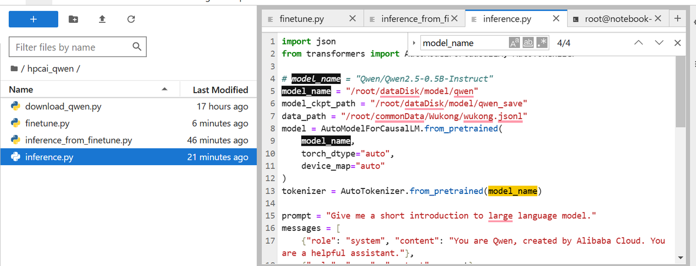

Save dependency to requirements.txt by following cmd:
```shell
pip3 freeze > ./requirements.txt
```

When you want to redeploy the environment, run the following cmd:
```shell
pip3 install -r ./requiremnts.txt
```

Then upload your repo
Run 'git status' to see what has changed since the last commit.
```shell
git add .
git commit
```

Use 'git branch' to check your branch and confirm which branch you want to push to
```shell
git branch
```
you will see the following output
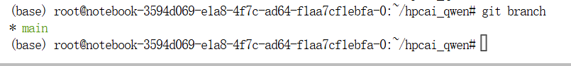

Push your code to the repository (using your github email + password)
```shell
git push origin main
```

# 4.2 Save your Cloud image
First, Stop your Cloud
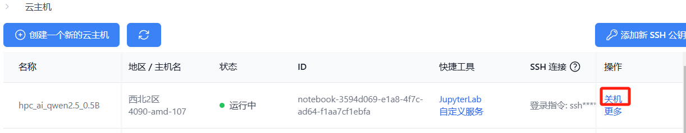

Click 'More' when the cloud hosting stops.
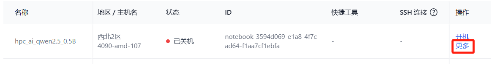

Select 'Save Image' from the drop-down list.
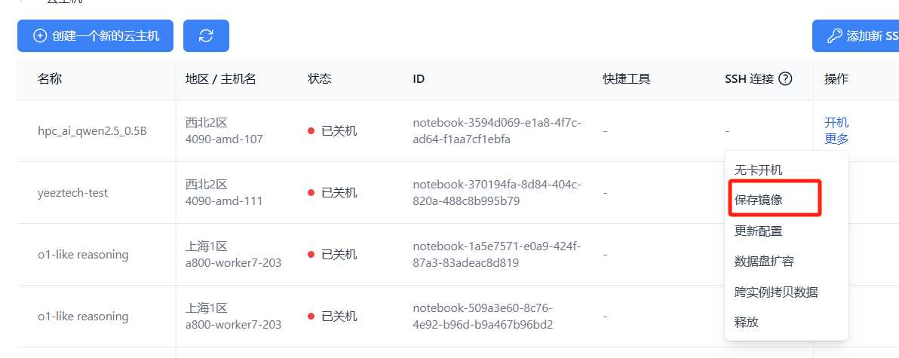

Enter the information in the pop-up window and click Confirm
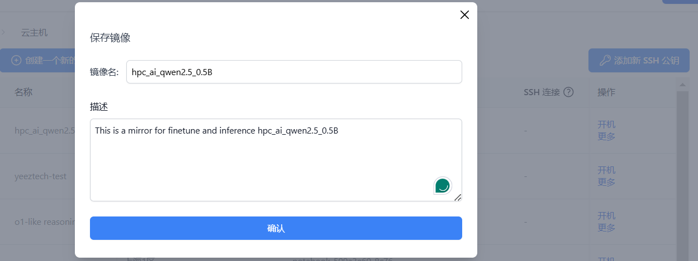

# 5.Other issues
## 5.1 Fail to download some packages
Try changing pip source when you execute 'pip3 install'
```shell
pip3 install -i https://pypi.tuna.tsinghua.edu.cn/simple bitsandbytes
```

## 5.2 Remember export path
```shell
export PATH=$PATH:/root/.local/bin/
```

## 5.3 Fail to push 
Network latency causes push not to work
In this case, you need to download the script locally and push it locally.

First select the script, select 'Download' (as shown below)
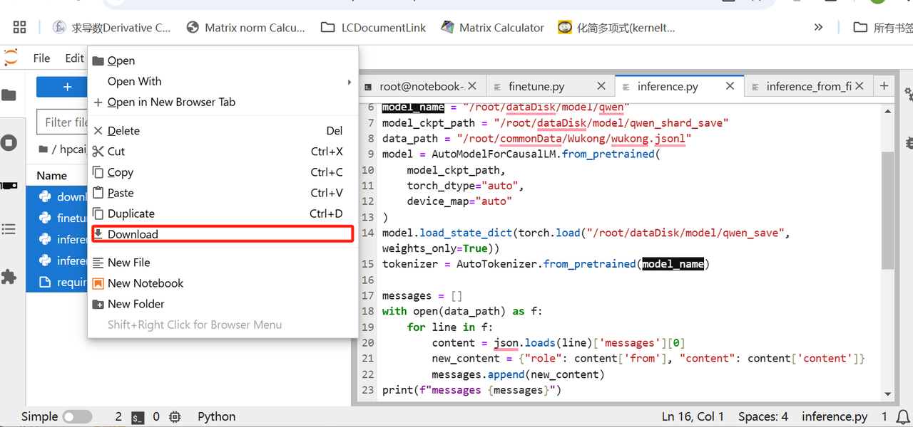

Git clone repo on your localhost
```shell
git clone https://github.com/duanjunwen/hpcai_qwen.git
```

Put the script downloaded from the cloud host into the clone folder.
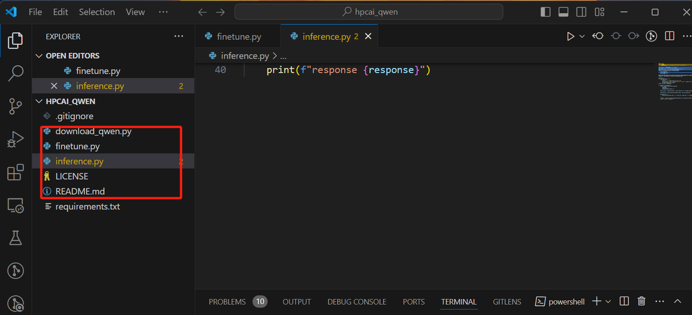

Add --> commit --> push on localhost
```shell
git add .
git commit
git push origin main
```

Push successfully
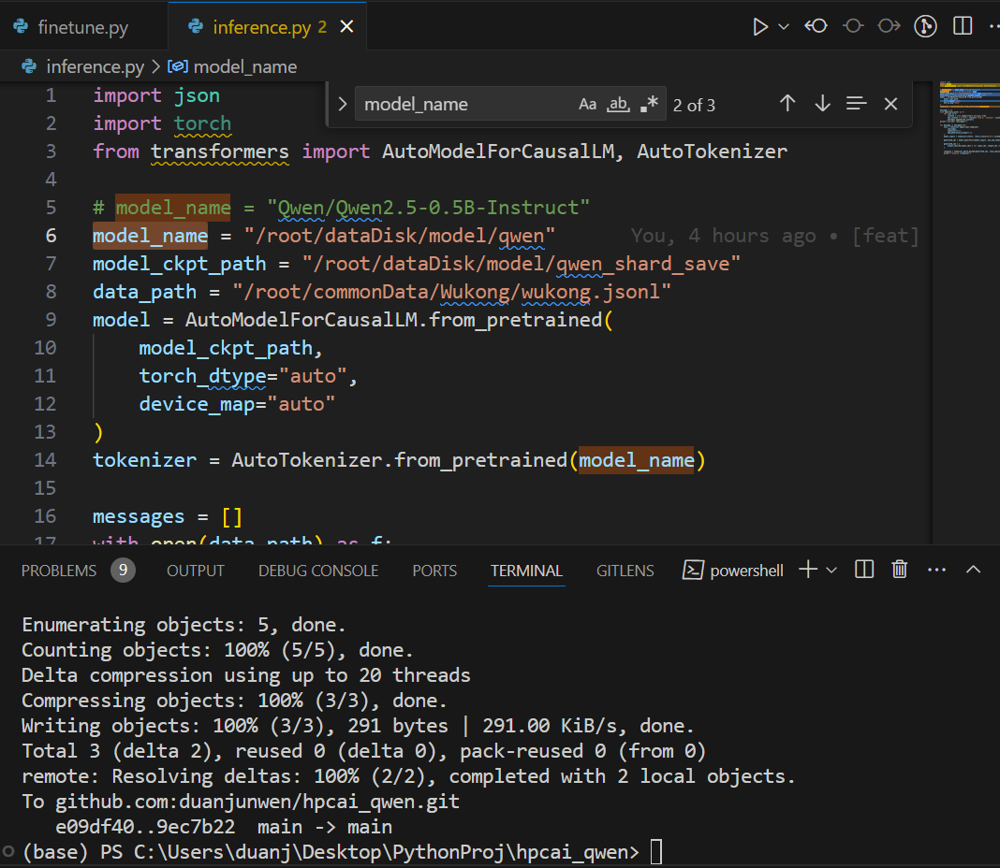

